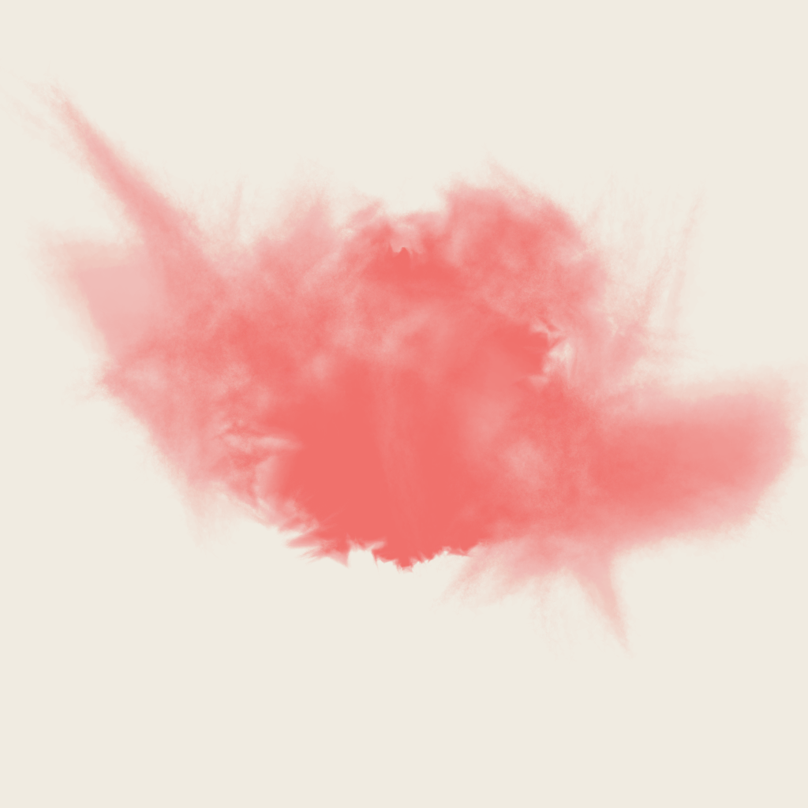
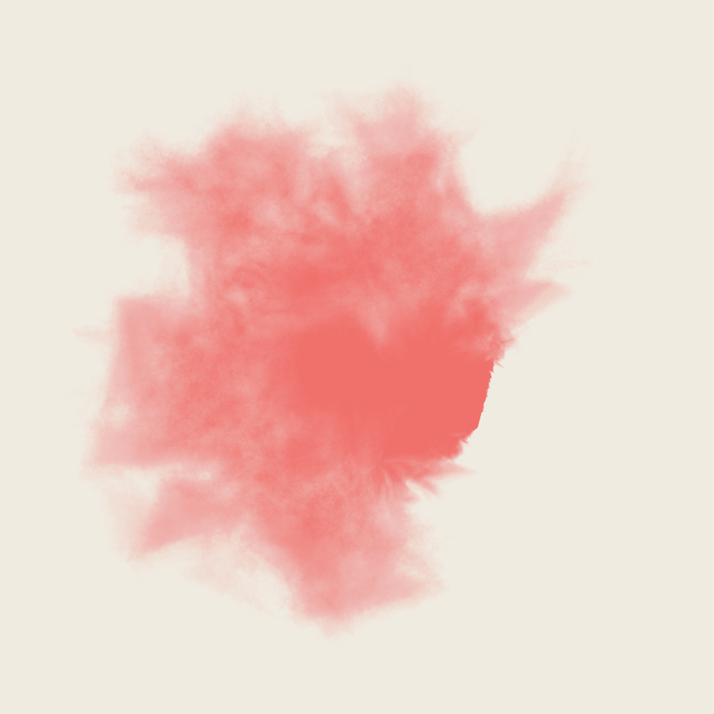

# Waterclour

An implementation of a porcess described [here](http://www.tylerlhobbs.com/writings/watercolor) to generate water colour effects by layering polygons.

Its a bit slow and could definately do with some work to get more interesting results and some colour layering.

